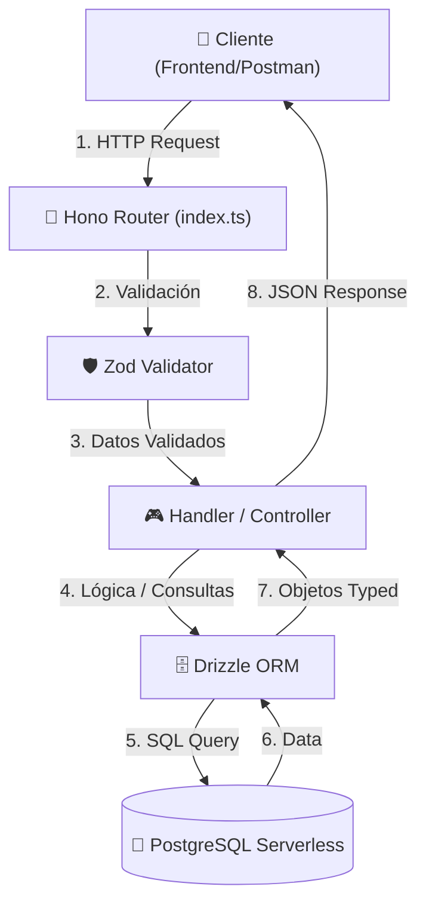

# 🚀 Hono MVP Backend Stack Guide: Silicon Valley Style
> **Senior Architecture & Tooling Blueprint**
> Diseñado para construir un backend rápido, seguro, escalable y mantenible desde el primer día.

Bienvenido al laboratorio de arquitectura backend. Como tu tutor sénior, mi objetivo es enseñarte a construir un backend siguiendo los estándares técnicos de las startups más exitosas de Silicon Valley: **velocidad de desarrollo excepcional (DX), máxima performance, tipado estricto de extremo a extremo y costos iniciales mínimos (serverless-friendly).**

Este documento detalla el stack y las herramientas que utilizaremos en nuestro MVP profesional.

---

## 🛠️ El Stack de Arquitectura (Silicon Valley Standard)

Para lograr un MVP profesional pero ágil, no podemos sobrediseñar con microservicios complejos, pero tampoco podemos crear código sucio o monolitos difíciles de escalar. Utilizaremos el siguiente stack:

| Componente | Herramienta | Razón de Elección |
| :--- | :--- | :--- |
| **Core Framework** | **Hono** | El framework web más rápido y moderno del ecosistema JavaScript/TypeScript. Corre en cualquier runtime (Node.js, Bun, Cloudflare Workers, Vercel). |
| **Runtime de Desarrollo** | **Node 24 (LTS) / Bun** | Máxima velocidad de ejecución y soporte activo a largo plazo. |
| **Lenguaje** | **TypeScript (Strict Mode)** | Tipado estricto para evitar el 90% de los errores en producción antes de desplegar. |
| **Base de Datos** | **PostgreSQL (Serverless)** | El estándar indiscutible. Escalabilidad instantánea usando plataformas como **Neon** o **Supabase**. |
| **ORM & Migraciones** | **Drizzle ORM** | El ORM moderno preferido en Silicon Valley. A diferencia de Prisma, Drizzle es *cero-overhead*, genera consultas SQL puras y ultra veloces, y es perfecto para ambientes serverless. |
| **Validación de Datos** | **Zod** | Validación robusta de payloads y esquemas en tiempo de ejecución. Integración nativa con Hono. |
| **Calidad de Código** | **Biome** (o ESLint) | Herramienta escrita en Rust que reemplaza a ESLint y Prettier. Formatea y analiza el código en milisegundos. |
| **Testing** | **Vitest** | Framework de pruebas unitarias y de integración ultra rápido basado en Vite, nativo para ESM y TS. |
| **Documentación** | **Swagger / OpenAPI** | Auto-generación de documentación interactiva para que tu frontend o consumidores externos entiendan tu API de inmediato. |

---

## 🏗️ Mapa de Flujo de Datos del MVP

A nivel de arquitectura, seguiremos una **Arquitectura en Capas Limpia (Clean Layered Architecture)** adaptada para velocidad de desarrollo. El flujo de una petición (Request) será el siguiente:

---

> [!IMPORTANT]
> **La regla de oro del MVP Moderno:** *Type-safety de extremo a extremo.*
> Los datos deben estar validados desde que entran a la API (Zod), se procesan en memoria con TypeScript y se consultan o insertan en la base de datos (Drizzle) sin perder nunca el autocompletado ni el tipado.

---

## 🏁 Hoja de Ruta del Laboratorio (Roadmap de Aprendizaje)

Construiremos este MVP estructurándolo en hitos lógicos:

### 📍 Fase 1: Estructuración del Proyecto
*   Configurar la estructura de carpetas profesional (`src/controllers`, `src/routes`, `src/db`, `src/middlewares`).
*   Configurar **Biome** para formateo automático y calidad de código.

### 📍 Fase 2: Modelado y Base de Datos
*   Configurar una base de datos PostgreSQL Serverless gratuita (usaremos **Neon** o **Supabase**).
*   Definir esquemas de datos con **Drizzle ORM** y realizar migraciones automáticas.

### 📍 Fase 3: Lógica de Negocio y Validaciones
*   Crear endpoints CRUD profesionales (por ejemplo, un sistema de gestión de tareas o usuarios).
*   Implementar validación estricta de payloads con **Zod** y manejo global de errores en Hono.

### 📍 Fase 4: Autenticación y Seguridad
*   Implementar JWT (JSON Web Tokens) nativos de Hono para proteger las rutas.
*   Crear un middleware de autorización.

### 📍 Fase 5: Documentación y Calidad
*   Generar documentación **Swagger** auto-generada desde nuestros esquemas Zod.
*   Escribir pruebas automatizadas con **Vitest**.

---

> [!NOTE]
> En la siguiente sesión, iniciaremos directamente con la **Fase 1**. Prepararemos la estructura del proyecto y dejaremos listo el linter/formatter para escribir código sumamente limpio.
